# kleiner-brauhelfer v2
[](https://github.com/kleiner-brauhelfer/kleiner-brauhelfer-2/releases/latest/)
[](https://github.com/kleiner-brauhelfer/kleiner-brauhelfer-2/releases/latest/)
[](https://github.com/kleiner-brauhelfer/kleiner-brauhelfer-2/releases/latest/)

Der kleine-brauhelfer ist ein Hilfsprogramm für Hobbybrauer zum Erstellen und Verwalten von Biersuden. Die Version 2 ist die Weiterentwicklung vom [kleinen-brauhelfer](http://github.com/Gremmel/kleiner-brauhelfer).

-  verfügbar auf Deutsch
-  available in English
-  finns på svenska
-  beschikbaar in het nederlands

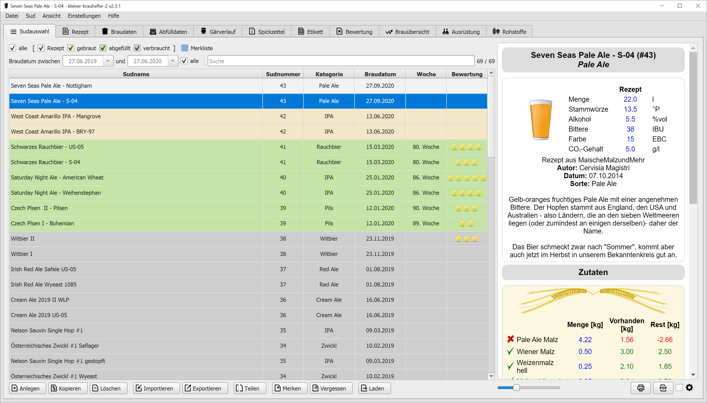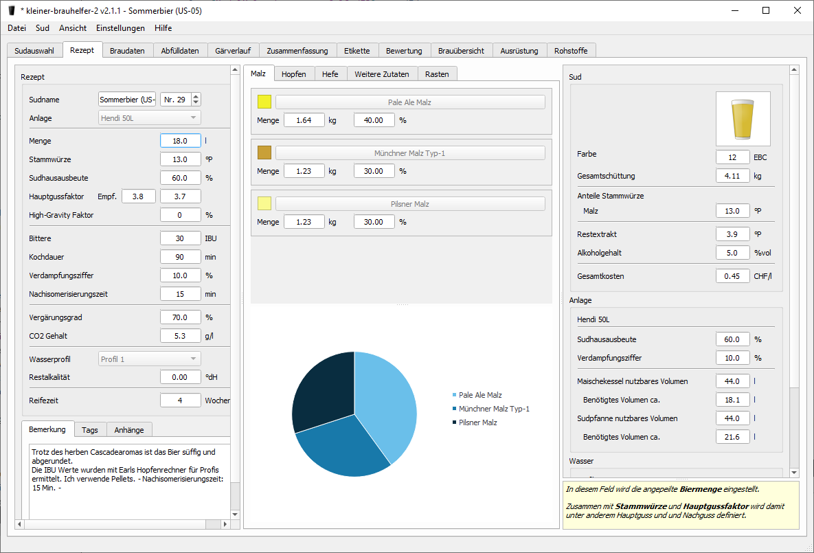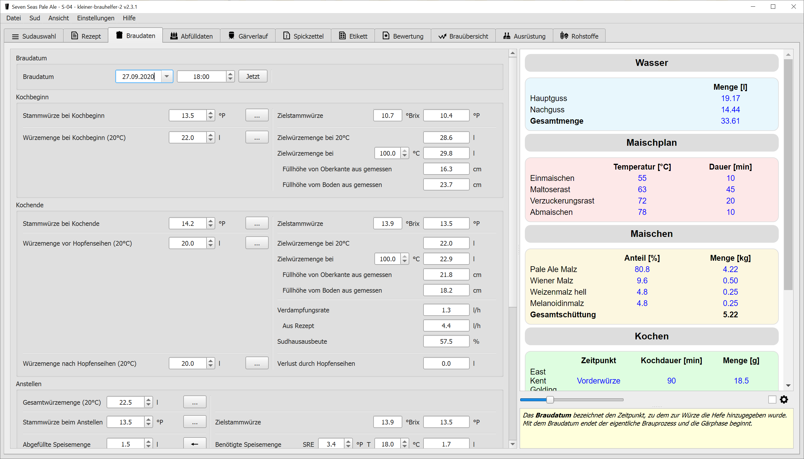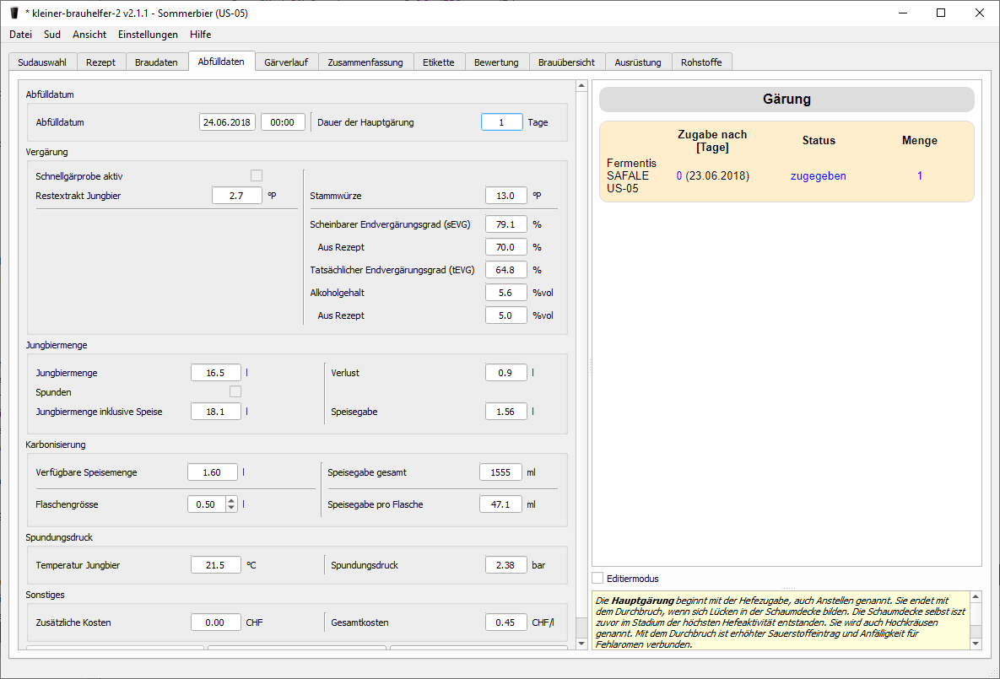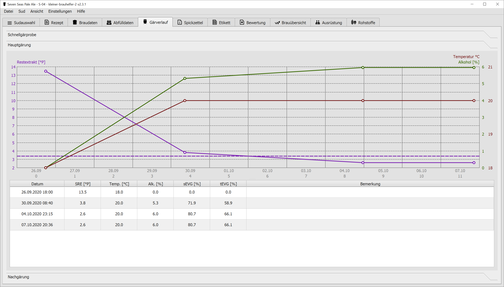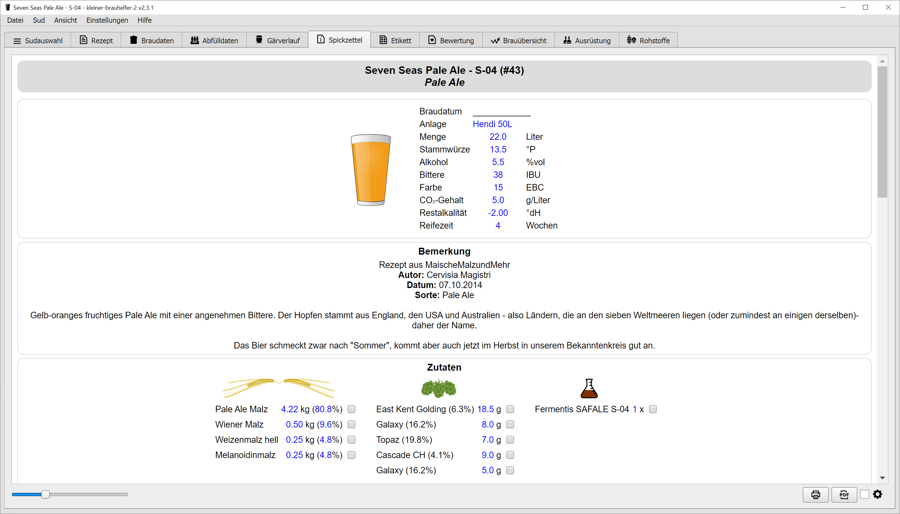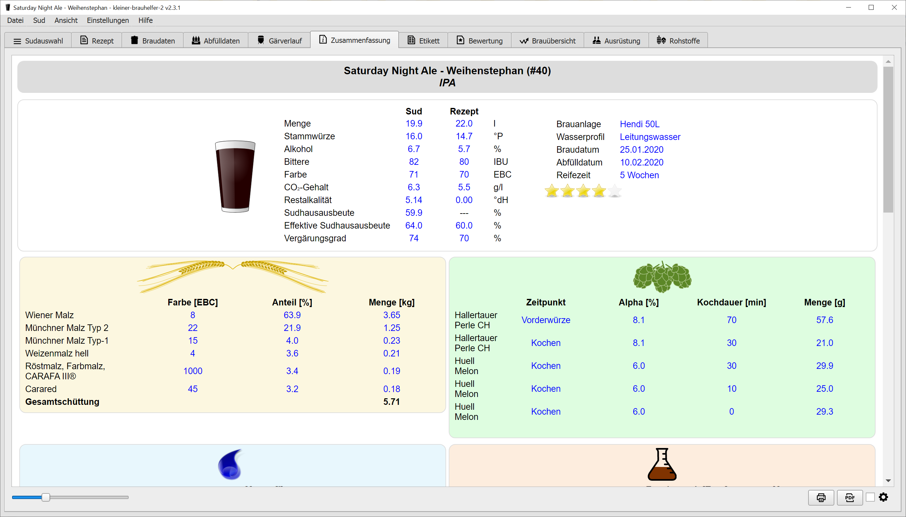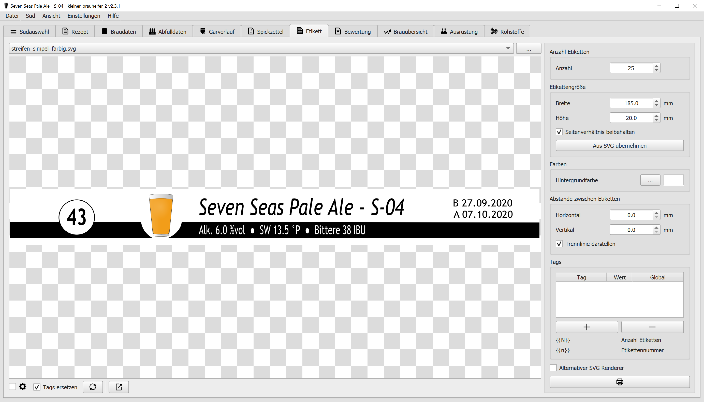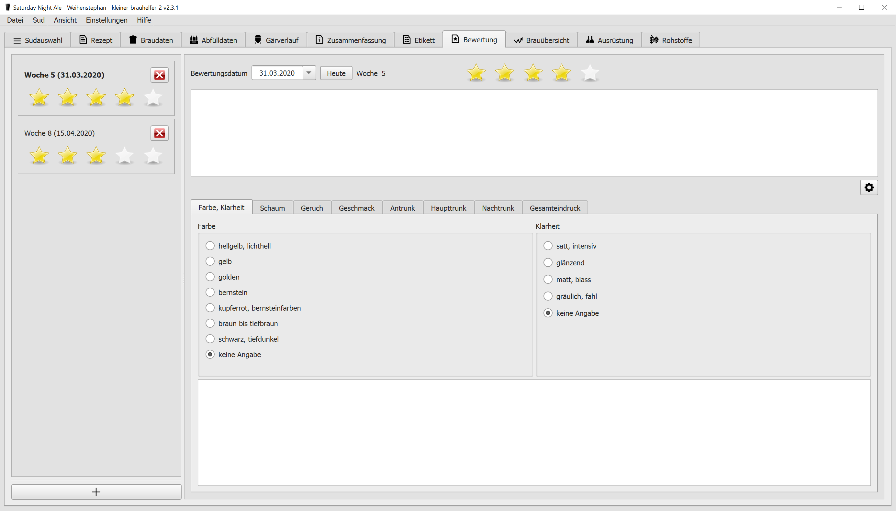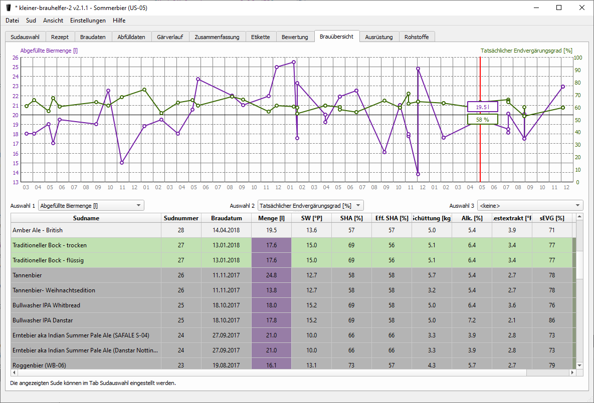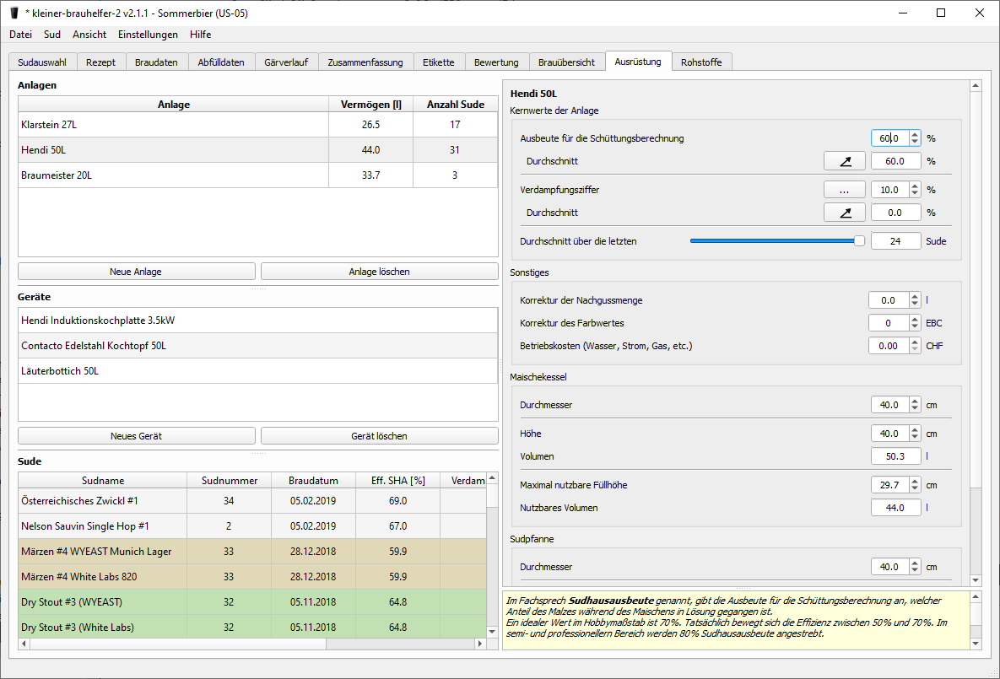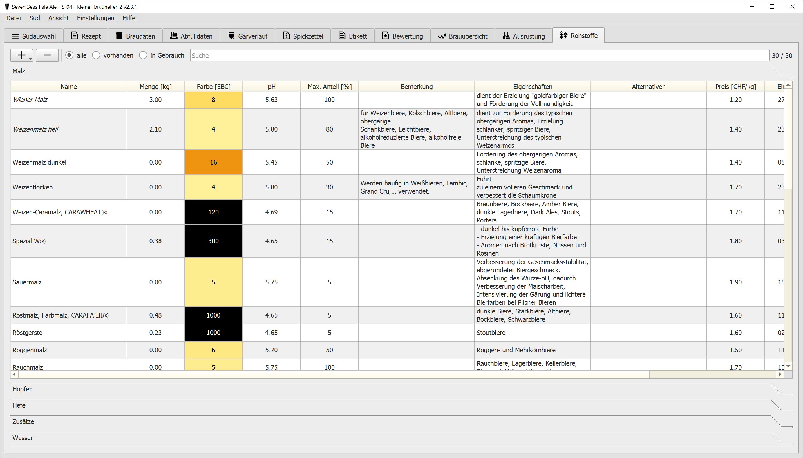

**Diskussion auf Hobbybrauer.de:**

https://hobbybrauer.de/forum/viewtopic.php?f=3&t=21510

**Credits:**
- Bibliothek für Diagramme: [QCustomPlot](http://www.qcustomplot.com)
- Code für Mustache Templates: [Qt Mustache](http://github.com/robertknight/qt-mustache)
- Code HTML Syntaxhighlighting: [Evgenii Legotckoi](http://evileg.com/en/post/218/)


## Download
- [Download](https://github.com/kleiner-brauhelfer/kleiner-brauhelfer-2/releases/latest/)
- [Changelog](CHANGELOG.md)

### Windows
- **kbh2_v2.x.x_setup_win_x64.exe**: Installationsdatei für 64bit System
- **kbh2_v2.x.x_portable_win_x64.zip**: Portable Version für 64bit System

### Linux
- **kbh2_v2.x.x_linux_x64.deb**: Debian Packet für 64bit System
  - Benötigt zusätzlich:
    - [Qt 6](https://www.qt.io/download-qt-installer) inklusiv Qt WebEngine, Qt WebChannel und Qt Positioning
    - OpenSSL 1.1.1b oder höher
- **kleiner-brauhelfer-2-x86_64.AppImage**: Portable Version (AppImage) für 64bit System
  
### Mac OS
- **kbh2_v2.x.x_macos.zip**: Installationsdatei für Mac OS


## Konfigurationsdatei kleiner-brauhelfer-2.ini
Einstellungen, welche sich nur über die INI Datei einstellen lassen.

### [General]
- **WebViewEnabled** (true oder false, default: true): aktiviert/deaktiviert die Webansichten
- **UndoEnabled** (true oder false, default: true): aktiviert/deaktiviert die Undo-Funktionalität 

### [Style]
- **Style** (fusion, windows, windowsvista, macos, default: fusion): GUI look and feel


## Hinweise

### Qt Installation unter Linux
Alternativ zum offiziellen [Qt Installer](http://www.qt.io/download-qt-installer) kann Qt mit [Another Qt installer (aqt)](http://github.com/miurahr/aqtinstall) installiert werden:
```
# Configure
VERSION='6.5.0'
QT_PATH="/opt/Qt"

# Location for logs and download files
mkdir /tmp/aqt
cd /tmp/aqt

# Install helper (https://github.com/miurahr/aqtinstall)
sudo pip install aqtinstall

# Install Qt
sudo python3 -m aqt install --outputdir ${QT_PATH} ${VERSION} linux desktop -m qtwebengine qtwebchannel qtpositioning

# Set ENV variables
export PATH=${QT_PATH}/${VERSION}/clang_64/bin/:$PATH
export QT_PLUGIN_PATH=${QT_PATH}/${VERSION}/clang_64/plugins/
export QML_IMPORT_PATH=${QT_PATH}/${VERSION}/clang_64/qml/
export QML2_IMPORT_PATH=${QT_PATH}/${VERSION}/clang_64/qml/
```
