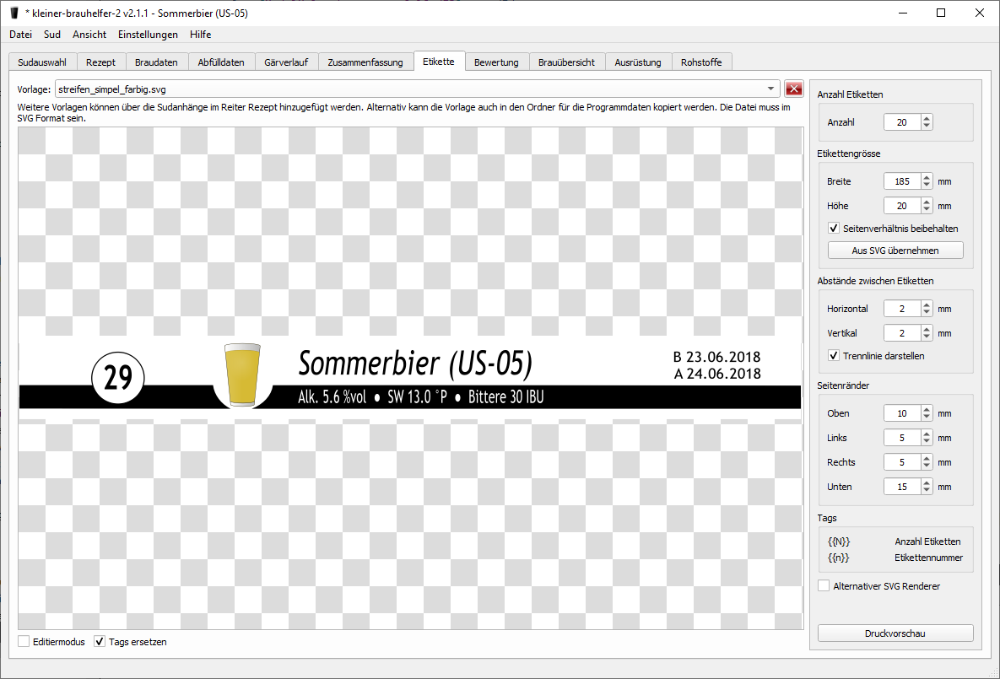

# kleiner-brauhelfer v2
Der kleine-brauhelfer ist ein Hilfsprogramm für Hobbybrauer zum Erstellen und Verwalten von Biersuden. Die Version 2 ist die Weiterentwicklung vom [kleinen-brauhelfer](http://github.com/Gremmel/kleiner-brauhelfer).

-  verfügbar auf Deutsch
-  available in English
-  finns på svenska
-  beschikbaar in het nederlands

**Diskussionsthread:**

https://hobbybrauer.de/forum/viewtopic.php?f=3&t=21510

**Credits:**

Flaggenicons erstellt von [Freepik](https://www.flaticon.com/authors/freepik) von [www.flaticon.com](http://www.flaticon.com/).

## Download letzte Version
- [Version 2.3.0](https://github.com/kleiner-brauhelfer/kleiner-brauhelfer-2/releases/latest/)

### Windows
- **kbh2_v2.x.x_setup_win_x64.exe**: Installationsdatei für 64bit System
- **kbh2_v2.x.x_portable_win_x64.zip**: Portable Version für 64bit System
- **kbh2_v2.x.x_setup_win_x86.exe**: Installationsdatei für 32bit System
- **kbh2_v2.x.x_portable_win_x86.zip**: Portable Version für 32bit System

### Linux
- **kbh2_v2.x.x_linux_x64.deb**: Installationsdatei für 64bit System
  - Benötigt zusätzlich Installation von [Qt 5.15.0](https://www.qt.io/download-qt-installer) mit folgenden Komponenten
    - Desktop gcc 64-bit, Qt Charts, Qt WebEngine
  - Benötigt OpenSSL 1.1.1b oder höher
- **kleiner-brauhelfer-2-x86_64.AppImage**: Portable Version (AppImage) für 64bit System
- **kbh2_v2.x.x_linux_x32.deb**: Installationsdatei für 32bit System
  - Neuere Qt Versionen werden für Linux 32bit nicht mehr angeboten. Deshalb werden nicht alle Features unterstüzt.
  - Benötigt zusätzlich Installation von [Qt 5.5](https://www.qt.io/download-qt-installer) mit folgenden Komponenten
    - Desktop gcc, Qt WebEngine
  - Benötigt OpenSSL 1.1.1b oder höher
  
### Mac OS
- **kbh2_v2.x.x_macos.zip**: Installationsdatei für Mac OS

## Hinweise

### Skalierung anpassen
Standardmässig wird der kleine-brauhelfer automatisch anhand der Pixeldichte des Monitors skaliert. Ist dies nicht erwünscht, kann diese Option mit dem Startparameter *QT_AUTO_SCREEN_SCALE_FACTOR=0* deaktiviert werden. Zusätzlich kann mit dem Startparameter *QT_SCALE_FACTOR=1.5* einen beliebigen Skalierungsfaktor angegeben werden (hier 150%).

## Änderungen & Erweiterungen

### Version 2.3.1 (in Entwicklung)
- Neu: Offizielle version kompiliert mit **Qt 5.15.2**
- Neu: Die meisten Eingabefelder für Bemerkungen unterstützen HTML (inklusive Editor)
- Neu: Modul Schnellgärprobe ein- und ausschaltbar

### Version 2.3.0 (24.03.2021)
- Neu: Datenbankversion **2006**
- Neu: Verschiedene Module lassen sich ein- und ausschalten (Menu Einstellungen/Module)
- Neu: Weitere Eingabemöglichkeiten für Bemerkungen (Brauen, Abfüllen, Gärung)
- Neu: Eingabemöglichkeit für Beginn der Reifung (nicht mehr an Nachgäverlauf gebunden)
- Neu: Farbige Erkennung, welche Felder geändert wurden
- Neu: Optionen bei Export im kleiner-brauhelfer Format
- Neu: Hintergrundfarbe der Etiketten einstellbar
- Neu: Negative Gärtemperaturen bis -20°C erlaubt
- Neu: Skalierungsfaktor für Benutzeroberfläche lässt sich über Argument "QT_SCALE_FACTOR=1.5" einstellen (kleiner-brauhelfer-2.exe QT_SCALE_FACTOR=1.5)
- Fix: Zeitpunkt der Hopfengaben nicht mehr in Abhängigkeit der Kochdauer
- Fix: Sortierung der Gärverläufe nach Datum
- Fix: Abfülldaten zeigt neu den scheinbaren Vergärungsgrad
- Fix: Negative Speisemenge bei eingeschalteter Schnellgärprobe

### Version 2.2.3 (23.01.2021)
- Neu: Niederländische Übersetzung (vielen Dank dachouffe)
- Neu: Tooltips komplett überarbeitet (vielen Dank rakader)
- Neu: Übernahme des Vergärungsgrades der Hefe
- Neu: Stil der Benutzeroberfläche fix auf "Fusion"
- Neu: Eingabemöglichkeit des Extrakts (Anteil an Stammwürze) für Malzgaben und weitere Zutaten
- Neu: Malzmengen prozentual anpassen (für Übernahme von Rezepten mit Angaben in Gewicht statt Prozent)
- Neu: High DPI Einstellung lässt sich über Argument "QT_AUTO_SCREEN_SCALE_FACTOR=0" deaktivieren (kleiner-brauhelfer-2.exe QT_AUTO_SCREEN_SCALE_FACTOR=0)
- Neu: Dialog für Log (Protokoll)
- Neu: Importfunktion für CSV Datei mit Gärdaten (auch per Drag & Drop)
- Neu: Separates Temperatureingabefeld für die Karbonisierung
- Neu: Bei "Sud gebraut zurücksetzen", "Hefe Zugabe zurücksetzen" und "Weitere Zutaten Zugabe zurücksetzen" lassen sich die Zutaten ins Lager zurücksetzen
- Neu: Neues Dialog für import & export mit Importfunktion aus URL oder Freitext
- Neu: Verschiedene Icons für die Buttons
- Neu: Begriff "weitere Zutat" wird durch "Zusatz" ersetzt
- Fix: Angaben Braumeister 10L
- Fix: Anpassen der Menge beim Ändern der Korrekturmenge in den Ausrüstungsreiter

### Version 2.2.2 (26.09.2020)
- Neu: Vorlagen für diverse Wasserprofile (vielen Dank rakader)
- Neu: Dialog "Restextrakt" überarbeitet
- Neu: Einstellbare Malztemperatur beim Einmaischen
- Fix: Im Reiter "Ausrüstung" Liste der Sude bei Anlage mit Sonderzeichen wird nicht angezeigt
- Fix: Dialog "Zutaten vom Lager abziehen" zeigt die Hopfenmenge nicht immer an
- Fix: Berechnung der Ist-Farbe und Ist-Bittere
- Fix: Übernahme der Verdampfungsrate vom Dialog im Reiter "Ausrüstung"

### Version 2.2.1 (19.07.2020)
- Fix: Sudinformation & Spickzettel werden nur angezeigt, nachdem Sprache eingestellt wird

### Version 2.2.0 (17.07.2020)
- Neu: Datenbankversion **2005**
- Neu: Programm als Beerware lizenziert (siehe Menü Hilfe/Bierspende)
- Neu: Englische & schwedische Übersetzung (Vielen Dank Thomas!)
- Neu: Direkte Auswahl bei Wasseraufbereiung
- Neu: Eingabemöglichkeit für gewünschter pH-Wert
- Fix: Sudkategorien nach oben/unten verschieben

### Version 2.2.0 Beta (27.06.2020)
- Neu: Offizielle version kompiliert mit **Qt 5.15.0**
- Neu: Datenbankversion **2004**
- Neu: Neue Spalte "Alternativen" bei Rohstofftabellen
- Neu: Rohstofftabellen etwas überarbeitet
- Neu: Eingabemöglichkeit für Bemerkungen bei den Anlagen
- Neu: Bei den Etiketten werden Papiergrösse und Ausrichtung gespeichert
- Neu: Eingabemöglichkeit einer Wassermenge bei Karbonisierung mit Zucker (Zuckerlösung)
- Neu: Verdampfungsrate (in l/h) ersetzt die Verdampfungsziffer (in %/h)
- Neu: Berechnung der Bierfarbe nach [brau!magazin](https://braumagazin.de/article/bierfarbe/)
- Neu: "Maischplan" ersetzt "Rasten"
- Neu: Unterstüzt Dekoktion als Maischverfahren
- Neu: Malz-, Hopfen-, Hefe-, weitere Zutatengaben und Maischplan lassen sich aus anderes Rezept übernehmen
- Neu: pH-Wert der Maische kann berechnet werden
- Neu: Sude lassen sich in Kategorien einteilen
- Neu: Neue Eingabefelder im Wasserprofil (Restalkalitätkorrektur und Bemerkung)
- Neu: Reiter Gäverlauf überarbeitet
- Neu: Aninmationen (ausschaltbar)
- Neu: Anlageprofil Brauheld Pro
- Neu: Wasserprofil Eingabemöglichkeit für Sulfat, Chlorid und Natrium
- Neu: Wasseraufbereiung für Zugabe von Säuren und andere Chemikalien

### Version 2.1.3 (02.05.2020)
- Neu: Suche in Rohstoffvorlage durchsucht alle Spalten
- Neu: Neue Import- & Exportfunktion (JSON Format), welche alle Suddaten enthält
- Neu: Datenbankbereinigung sucht ungültige Werte
- Neu: Verschiedene Reiter lassen sich verstecken
- Neu: Neue Anlageeinstellung: Korrektur der Sollmenge, um Verluste zu kompensieren
- Neu: Hopfengaben werden nach Tinseth berechnet und weitere Einflüsse (Pellets, Eiweissbruch, Nachisomerisierung) gemäss [MMuM](https://www.maischemalzundmehr.de/index.php?inhaltmitte=toolsiburechner)
- Fix: "Sud löschen" bei nicht-gespeichertem Sud löscht auch Einträge aus anderen Tabellen

### Version 2.1.2 (12.04.2020)
- Neu: Unterstützung der [oBraMa](https://obrama.mueggelland.de/) Datenbank fürs Einfügen von neuen Rohstoffe (erfordert Internetverbindung)
- Neu: Sudhausausbeute und Vergärungsgrad wird beim Import aus MMuM übernommen
- Neu: Neue Kategorien für "Weitere Zutaten": "Kraut", "Wasseraufbereiung" und "Klärmittel"
- Neu: Neue Einheiten für "Weitere Zutaten": "l" und "ml"
- Neu: "Weitere Zutaten" in HTML Templates überarbeitet (Listen zusammengeführt)
       **Eigene Templates müssen auch überarbeitet werden!**
- Neu: Anlagetyp kann gesetzt werden (Grainfather & Braumeister)
       **Daten sind nicht vollständig!**
- Neu: Direkter PDF Druck wieder möglich
- Fix: Nachisomerisierungszeit bis 90 Minuten
- Fix: Sud kopieren/teilen mit Hopfengaben ohne IBU Berechnung

**Wichtig Linux 64bit:** OpenSSL 1.1.1b oder höher wird für die Überprüfung auf Updates und die oBraMa Anbindung benötigt.
https://askubuntu.com/questions/1102803/how-to-upgrade-openssl-1-1-0-to-1-1-1-in-ubuntu-18-04

### Version 2.1.1 (01.03.2020)
- Neu: Neue Menufunktionen (Sud anlegen, kopieren, teilen, löschen, Rezept importieren, exportieren)
- Neu: Eingabemöglichkeit für Hopfengaben in g/l
- Neu: Hopfenberechnung lässt sich deaktivieren (Prozentanteil enstpricht: ignorieren) für freie Hopfengaben
- Neu: Direktes Drucken des Spickzettels und Zusammenfassung
- Fix: Diverse Felder wurden nicht auf schreibgeschützt gesetzt
- Fix: Hopfengaben beim Ausschlagen haben jetzt eine Ausbeute von 0.0%
- Fix: Brix Berechnung im Spickzettel
- Fix: Minimale Fenstergrösse

### Version 2.1.0 (25.01.2020)
- Neu: Datenbankversion **2003**
- Neu: Dialog für Zutatauswahl
- Neu: Zutatenliste im Spickzettel
- Neu: Sudspezifische Sudhausausbeute und Verdampfungsrate
- Neu: Eingabemöglichkeit des Endvergärungsgrads für die Abschätzung des Alkoholgehalts
- Neu: Gärverlaufeinträge lassen sich über das Clipboard importieren (Copy&Paste)
- Neu: Eingabemöglichkeit für die Stammwürze bei Kochbeginn (nur fürs Protokoll)
- Neu: Eingabemöglichkeit für die Würzemenge vor/nach Hopfenseihen, statt nur bei Kochende
- Neu: Anhänge lassen sich über einen Knopf öffnen
- Neu: Sollstammwürze neu auch in °Brix
- Neu: Update Spickzettel
- Fix: Update der Ressourcen verbessert (erst bei nächstem Update wirksam)
- Fix: Farben für HTML Editiermodus beim dunklen Design
- Fix: Verdünnungsmenge bezieht sich neu auf die Würzemenge beim Anstellen
- Fix: Gebrauter Sud teilen teilt auch Gesamtschüttung und Wassermenge

### Version 2.0.0 (22.12.2019)
- Neu: Datenbankversion **2001**
- Neu: Datenbankdatei wird nur bei erfolgreichem Update verändert
- Neu: Ressourcen wurden in Unterverzeichnisse verschoben
- Neu: Gärverlauf zeigt auch scheinbarer Endvergärungsgrad
- Neu: Neue Spalte "Bemerkung" für Einträge in Gärverläufen
- Neu: Reiter Etiketten überarbeitet
- Fix: Berechnung der Karbonisierung (Speise & Zucker) nach [MMuM](https://www.maischemalzundmehr.de/index.php?inhaltmitte=toolsspeiserechner)
- Fix: Sortierung der Rohstoffe nach Zahlen

### Version 2.0.0beta5 (29.11.2019)
- Neu: Tooltips ein- & ausschaltbar
- Neu: Dialog, um Zutaten vom Rohstofflager abzuziehen
- Neu: Reihenfolge der Rasten änderbar
- Neu: Weitere Hefegaben lassen sich im Reiter Gärverlauf zugeben
- Fix: Grösse der Dialogue
- Fix: Tags bei den Etiketten verwendbar

### Version 2.0.0beta4 (16.11.2019)
- Neu: Offizielle version kompiliert mit Qt 5.13.2
- Neu: Tooltips für die meisten Eingabefelder (Danke rakader)
- Neu: Spickzettel zeigt auch Kochdauer von Hopfengaben und weitere Zutaten
- Neu: Logdatei, wenn Einstellung LogLevel (1-4) in kleiner-brauhelfer-2.ini gesetzt wird
- Neu: Tabellen können in den Clipboard kopiert werden
- Neu: Knopf, um Rohstoff "aufzubrauchen"
- Fix: Eingabe über Buttons für "Stammwürze Kochende", "Stammwürze Anstellen", "Restextrakt Schnellgärprobe" und "Restextrakt Jungbier"
- Fix: Bei BeerXml Export werden alle Pflichtfelder exportiert
- Fix: Keine Rohstoffangabe im Sudinfo bei Rohstoffen mit Klammern
- Fix: Hopfenmengenangaben gehen bei Umstellung der Berechnungsart nicht verloren

### Version 2.0.0beta3 (12.10.2019)
- Neu: Funktion "Eingabefelder entsperren"
- Neu: Umrechnung zwischen Palto und spezifische Dichte nach [Brewer's Friend](http://www.brewersfriend.com/plato-to-sg-conversion-chart/)
- Neu: Milchsäurangabe in 0.1 ml Schritte
- Neu: HTML Templates werden nur aktualisiert, wenn das entsprechende Reiter aktiv ist
- Neu: Zielstammwürze bei Kochbeginn mit/ohne weiteren Zutaten "Kochen" separat aufgeführt
- Neu: Weitere Zutaten können in Milligramm und Stücke angegeben werden
- Fix: Aktualisierung der Hopfenmenge nach Änderung des Hopfens
- Fix: Dialog Rohstoffaustausch beim Löschen eines Hopfens, welches als Stopfhopfen verwendet wird
- Fix: "Sud löschen" löscht auch die Hefegaben

### Version 2.0.0beta2 (28.07.2019)
- Fix: Woche war immer auf 0
- Fix: Abstürze wegen "race condition" in Model Sud
- Fix: Dialog für Stammwürze/Restextrakt zeigt Formel und Korrekturfaktor für Refraktometer
- Fix: Korrektur in der Berechnung der Malzschüttung (Faktor 0.96)
- Neu: keine automatische Sortierung der Rasten
- Neu: Reihenfolge in der Tabelle *Brauübersicht* gedreht
- Neu: Kochzeit bei Honig & Zucker einstellbar
- Neu: Filter für Sudauswahl sucht auch in Tagnamen und Tagwerte
- Neu: Filter für Sudauswahl Checkboxes statt Radiobuttons
- Neu: zusätzliche Spalten in der Sudauswahl auswählbar
- Neu: Zeitpunkt der Hopfengabe auswählbar (Vorderwürze, Kochen, Nachisomerisierung, beim Ausschlagen)
- Neu: Dialog, um ungültige Zutatengaben zu löschen
- Neu: Spickzettel & Zusammenfassung fertiggestellt
- Neu: Dunkles Design fertiggestellt
- Neu: Import & Export für MaischeMalzundMehr und BeerXml
- Neu: Funktion, um Datenbank zu bereinigen
- Neu: Reiter Navigation mit F1 - F12

### Version 2.0.0beta1 (28.05.2019)
- Neu: Datenbankversion **2000**
- Neu: kompletter Neuaufbau des Programms
- Neu: mehrere Hefegaben pro Sud möglich
- Neu: mehrere Wasserprofile möglich
- Neu: Filterfunktion für Rohstofftabellen 
- Neu: mehr Gestaltungsmöglichkeiten bei den HTML Templates
- Neu: Filter im Reiter *Sudauswahl* bestimmt die angezeigten Sude im Reiter *Brauübersicht*
